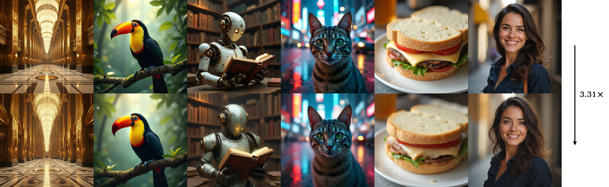
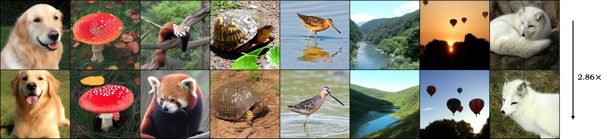
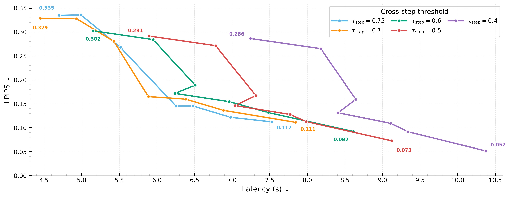
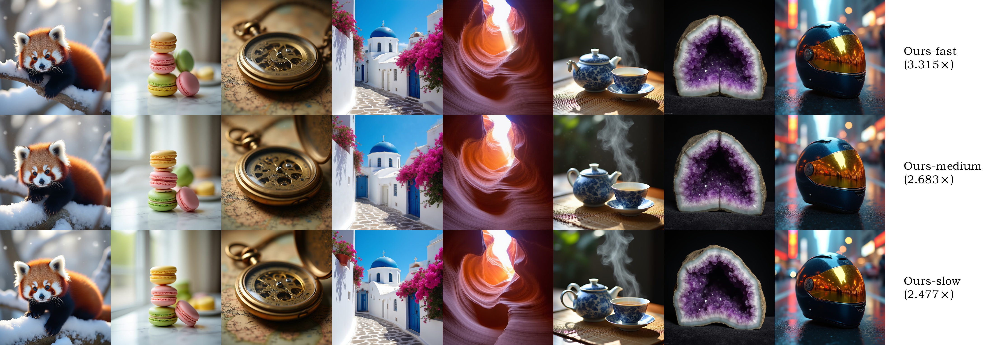
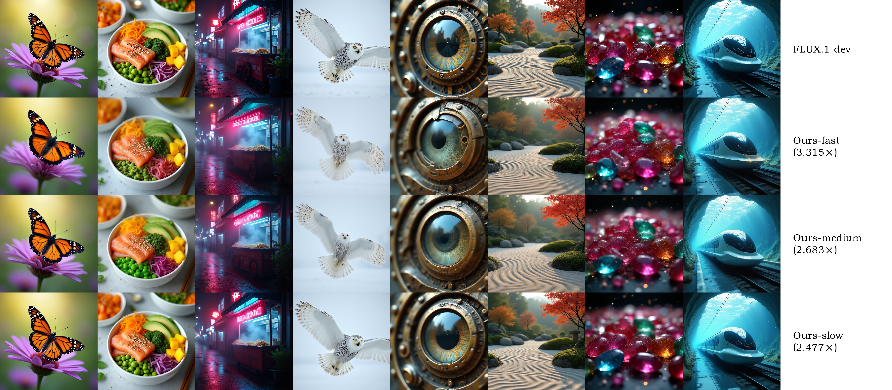
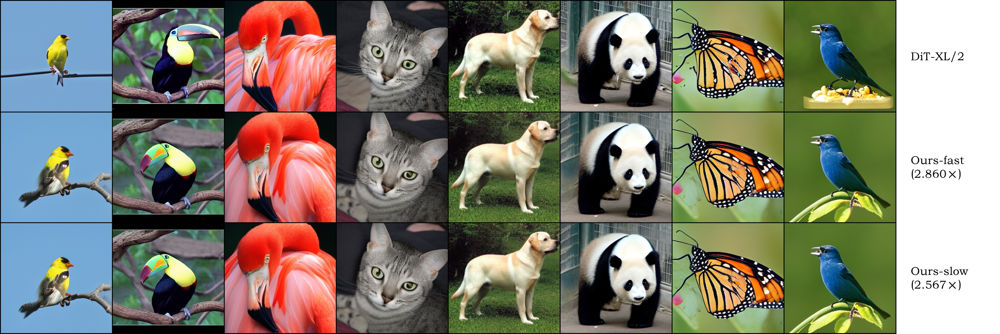
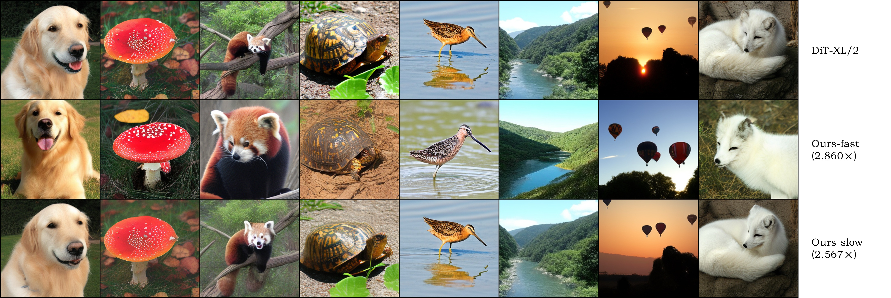

# InvarDiff: Cross-Scale Invariance Caching for Accelerated Diffusion Models

<p align="center">
  <strong>Paper: </strong>
  <a href="https://arxiv.org/abs/2512.05134">arXiv:2512.05134</a>
  &nbsp;·&nbsp;
  <a href="https://arxiv.org/pdf/2512.05134.pdf">PDF</a>
</p>

<p align="center"><b><i>(a) FLUX.1-dev</i></b></p>



<p align="center"><b><i>(b) DiT-XL/2</i></b></p>



## Introduction

**InvarDiff** is a **training-free acceleration framework** for diffusion models.

Built on feature invariance in deterministic sampling, InvarDiff generates a **binary reuse plan** across timesteps and layers and applies a **step-first, then layer-wise** caching policy at inference, reducing redundant compute while preserving fidelity. The method is validated on **FLUX.1-dev** and **DiT-XL/2**.

### Core contributions

- **Cross-scale invariance identification**
  Quantile-based change metrics measure stability at the **timestep** and **layer/module** levels, producing an interpretable **binary cache matrix** `C[t, l, s]` and a **step gate** `c[t]`.
- **Two-phase calibration with resampling correction**
  A few deterministic runs generate the initial thresholds; a second pass applies **resampling correction** to mitigate drift under **consecutive reuse**, yielding robust plans for deployment.
- **Deterministic execution: step-first, layer-wise next**
  At runtime, InvarDiff first decides whether an entire step can be reused, otherwise it selectively reuses modules/layers. The schedule is fixed and predictable, requiring no model retraining.
- **Strong end-to-end speedups with minimal quality loss**
  Under paper settings, InvarDiff reaches **up to 3.31×** e2e speedup on **FLUX.1-dev (T=28)** and **up to 2.86×** on **DiT-XL/2 (T=50)**, with minimal impact on standard quality metrics and qualitatively near-identical results to full computation.
- **Practical and easy to reproduce**
  A three-step workflow: **calibrate → build plan → accelerated sampling**, with small calibration sets, JSON plans that can be versioned, and scripts for benchmarking and visualization.

### Speed–Quality tradeoff on FLUX.1-dev (A800, $T{=}28$)



- Each point shows latency and LPIPS for one operating point (35 total, calibration averages 5 prompts). 
- Each polyline fixes $\tau_{\mathrm{step}}\!\in\!\{0.40,0.50,0.60,0.70,0.75\}$ and sweeps seven preset threshold bundles. A bundle is $\bigl(\tau_{\texttt{warm-up}}, \tau_{\texttt{dual\_attn}}, \tau_{\texttt{dual\_ff}}, \tau_{\texttt{dual\_context\_ff}}, \tau_{\texttt{single\_attn}}, \tau_{\texttt{single\_ff}}\bigr)$. 

- Bundle order is aligned across polylines, only $\tau_{\mathrm{step}}$ changes.

### Overview

#### ***FLUX.1-dev***







#### ***DiT-XL/2***






## Citation

If you find InvarDiff useful or interesting for research or applications, please cite this work using the BibTeX below:

```bibtex
@misc{wu2025invardiffcrossscaleinvariancecaching,
      title={InvarDiff: Cross-Scale Invariance Caching for Accelerated Diffusion Models}, 
      author={Zihao Wu},
      year={2025},
      eprint={2512.05134},
      archivePrefix={arXiv},
      primaryClass={cs.CV},
      url={https://arxiv.org/abs/2512.05134}, 
}
```
